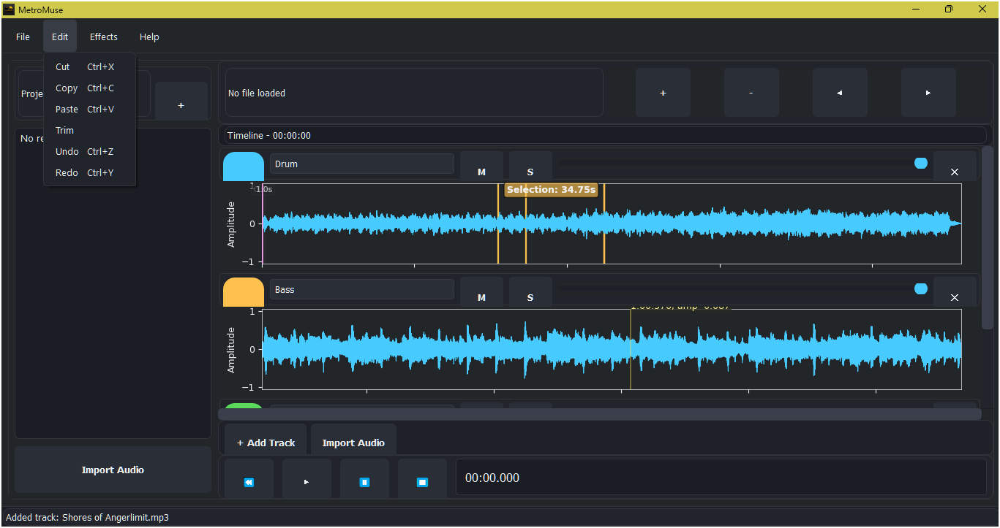

**Version 0.10.0 (INCOMPLETE BETA)**

> ⚠️ **NOTE:** MetroMuse is currently in beta. Some features may be incomplete or unstable.

A modern, cross-platform audio editor with multitrack support, enhanced waveform visualization, and a sleek interface.

## 

## 🤝 Contributing

MetroMuse is open source and welcomes contributors! You can help by:

- Reporting issues
- Improving existing features
- Refactoring code
- Designing UI components
- Translating to other languages

Please fork the repository, create a feature branch, and submit a pull request.

---

## Current Features

### 🎚️ Multitrack Support

- Multiple audio track management
- Track-specific controls (solo, mute, volume)
- Individual track color coding
- Synchronized playback across tracks
- Track naming and organization

### 📊 Enhanced Waveform Display

- Interactive waveform visualization
- Adaptive time grid and markers
- Real-time amplitude display
- Zoom and scroll functionality
- Advanced scrubbing support

### ✂️ Audio Editing

- Cut, copy, paste operations
- Selection-based editing
- Multiple undo/redo support
- Track-specific editing
- Non-destructive editing

### 🎛️ Audio Effects

- Gain adjustment (volume)
- Fade in/out effects
- Per-track volume control
- Real-time effect preview
- Effect parameter adjustment

### ▶️ Advanced Playback

- Multi-track synchronized playback
- Track soloing and muting
- Real-time mixing
- Position scrubbing
- Playback position tracking

### 🎨 Modern Interface

- Dark theme with accent colors
- Large, accessible controls (48x48px)
- Intuitive track management
- Collapsible panels
- Enhanced visual feedback

### 💾 File Support

- Import/Export: WAV, FLAC, MP3, AAC
- Drag and drop support
- Recent files management
- File information display
- Multiple audio format handling

### 🔧 Technical Features

- Sample-accurate editing
- Multi-channel audio support
- High-quality audio processing
- Real-time waveform updates
- Efficient audio rendering

## 🔧 Development Status (Version 0.10.0)

| Component        | Status        | Notes                                             |
| ---------------- | ------------- | ------------------------------------------------- |
| Waveform Display | 🟡 Functional | Enhanced with scrubbing, time grid, and markers   |
| Multitrack       | 🟡 Functional | Full support with track controls and mixing       |
| Editing Tools    | 🟡 Functional | Cut, copy, paste, fade, gain with undo/redo       |
| Exporting        | 🟡 Functional | Supports WAV, FLAC, MP3, AAC formats              |
| Playback         | 🟡 Functional | Synchronized multitrack playback with visual sync |
| UI/UX            | 🟡 Functional | Modern dark theme with enhanced controls          |

## 📁 Project Structure
```
MetroMuse/
│
├── src/
│ ├── metro_muse.py # Main application
│ ├── track_manager.py # Multitrack management
│ ├── track_renderer.py # Waveform visualization
│ ├── styles.qss # UI styling
│ ├── icon.png # Application icon
│ └── icon.ico # Windows icon
│
├── resources/
│ ├── ffmpeg.exe # Audio processing
│ ├── ffprobe.exe # Media analysis
│ └── ffplay.exe # Audio playback
│
├── requirements.txt # Python dependencies
└── README.md # Documentation
```
## 📦 Dependencies

- PyQt5 - GUI framework
- numpy - Audio processing
- matplotlib - Waveform visualization
- pydub - Audio file handling
- librosa - Audio analysis
- sounddevice - Audio playback
- qtsvg - SVG icon support
- python-qss - Stylesheet support
- PyQt5-stubs - Type hints
- ffmpeg (required for mp3, aac, flac support)

## 🚀 Installation

1. Clone the repository:

bash
git clone <https://github.com/Ivan-Ayub97/MetroMuse-AudioEditor.git>
cd MetroMuse

2. Install required Python packages:

bash
pip install -r requirements.txt

3. Install ffmpeg:

- Windows: winget install ffmpeg (or you can directly place the ffmpeg.exe, ffplay.exe and ffprobe.exe bin in the resources/ folder)
- macOS: brew install ffmpeg
- Linux: sudo apt install ffmpeg

## 🎮 Usage

Run the application:

bash
python src/metro_muse.py

### Track Management

- Add Track: Click "+ Add Track"
- Import Audio: Click "Import Audio" or drag-and-drop
- Delete Track: Click "✕" on track header
- Track Settings: Use track header controls

### Playback

- Play/Pause: Space
- Stop: Esc
- Rewind: Home
- Fast Forward: End
- Scrub: Click and drag waveform

### Navigation

- Zoom In: Mouse wheel up
- Zoom Out: Mouse wheel down
- Pan: Arrow keys
- Quick Zoom: Ctrl + Mouse wheel

## 🔜 Planned Features

- Spectrum analysis view
- Additional audio effects (echo, reverb, eq)
- VST plugin support
- Project saving/loading
- Track automation
- Enhanced error handling
- User guide dialogs

## ⚠️ Known Issues

- Export may fail without ffmpeg configured correctly
- Some audio effects still in development (echo, reverb)
- VST plugin support not yet implemented
- Project saving/loading not yet implemented

## 💻 System Requirements

- **Python**: 3.7 or higher
- **Dependencies**:
  - All dependencies listed in the Dependencies section above
  - ffmpeg (must be in PATH or in resources/)

## 📄 License

This project is licensed under the **[MIT License](LICENSE)**.

## 👤 Author

- **Developer**: [Iván Eduardo Chavez Ayub](https://github.com/Ivan-Ayub97)
- **Contact**: <negroayub97@gmail.com>
- **Technologies**: Python 3, PyQt5, pydub, librosa

## 🌟 Why MetroMuse?

Because sometimes all you need is a clean, focused editor that works. MetroMuse aims to simplify audio editing with a modern interface and a clear feature set—open, hackable, and evolving with your feedback.
