**Version 0.12.0 (INCOMPLETE BETA)**

> ⚠️ _Disclaimer:_ MetroMuse is currently in beta. Some features may be incomplete, unstable, or under development.

### **A modern, cross-platform audio editor** with multitrack capabilities, enhanced waveform visualization, and an intuitive, sleek interface.

---

## Contributions
We welcome your contributions!
Fork the repo.
Create a branch for your feature or fix.
Submit a Pull Request with a clear description of your changes.
For bug reports, suggestions or questions, reach out at negroayub97@gmail.com.

---

### 🔹 New Icon


## 📸 Interface Preview

### 🔹 General UI

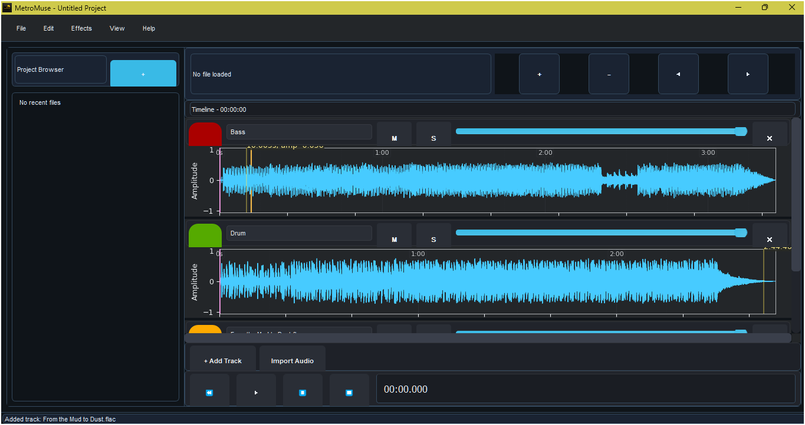

### 🔹 File Bottom Options

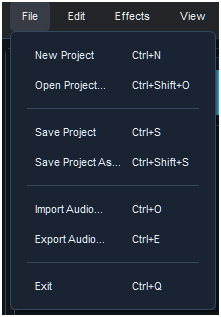

### 🔹 Edit Bottom Options                     

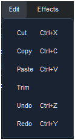  

### 🔹 Effects Bottom Options

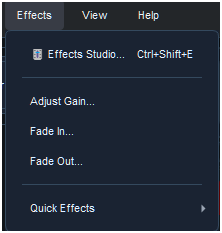
   
    🔹 Quick Effects Menu

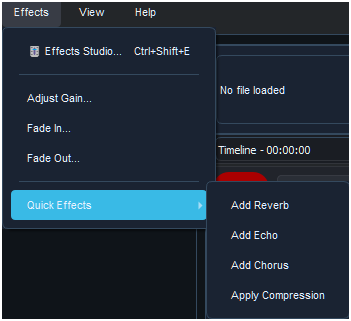

### 🔹 Audio Effects Studio UI

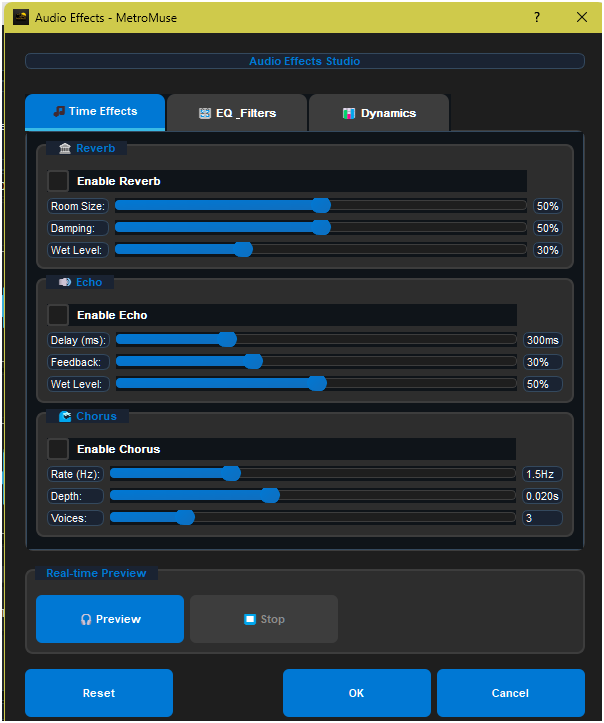
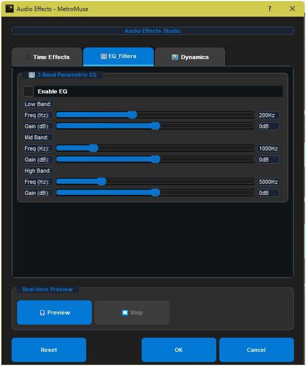
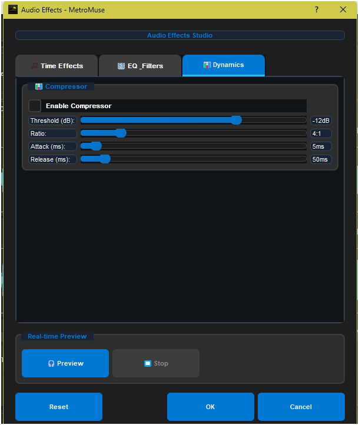

### 🔹 View Bottom Options

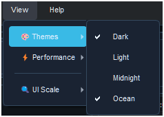
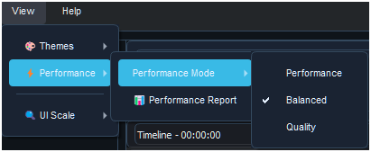
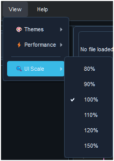

### 🔹 Shortcuts & About 

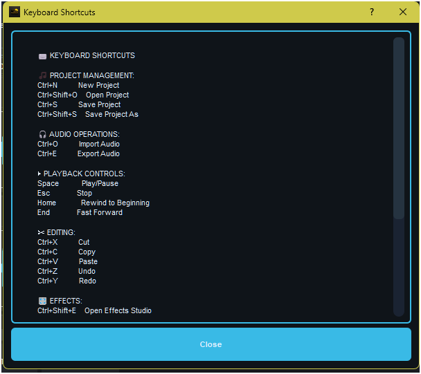
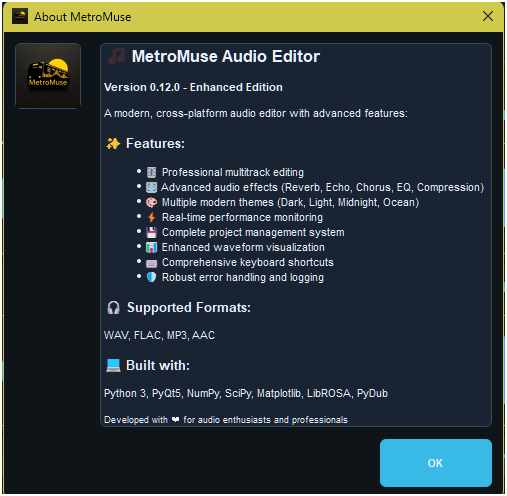

---

## ✨ Features Overview

### 🎚️ Multitrack Support

- Solo, mute, and volume per track
- Color coding & track naming
- Synchronized playback
- **NEW:** Asynchronous audio loading
- **NEW:** Optimized waveform rendering

### 📊 Waveform Visualization

- Zoomable, interactive display
- Adaptive time grids & real-time amplitude
- **NEW:** Automatic downsampling
- **NEW:** Performance-based detail levels

### ✂️ Editing Tools

- Cut, copy, paste with precision
- Non-destructive edits & track-specific editing
- **NEW:** Improved error recovery
- **NEW:** Enhanced keyboard shortcuts

### 💾 Project System

- **NEW:** Full save/load with `.mmp` format
- **NEW:** Recent project manager
- **NEW:** Auto-save & tracking
- **NEW:** Project templates/presets

### 🔧 Performance Monitoring

- **NEW:** Real-time CPU/RAM usage
- **NEW:** Quality/Performance modes
- **NEW:** System recommendations

### 🛡️ Error Handling

- **NEW:** Detailed logging
- **NEW:** Friendly error dialogs
- **NEW:** Auto recovery & warnings

### 🎛️ Audio Effects

- Volume, fade-in/out, real-time previews
- Per-track parameters

### ▶️ Playback

- Real-time scrubbing & synced playback
- **NEW:** Optimized mixing engine

### 🎨 UI/UX

- Dark theme with highlights
- Accessible 48x48px elements
- **NEW:** Improved shortcuts & project-aware window title

### 💾 File Formats

- WAV, MP3, AAC, FLAC support
- Drag-and-drop + metadata display
- **NEW:** Better format handling

### ⚙️ Technical Highlights

- Sample-accurate edits
- Real-time waveform updates
- **NEW:** Memory-efficient rendering
- **NEW:** Background processing
- **NEW:** Auto resource management

---

## 🛠️ Development Status — v0.12.0

| Component           | Status        | Notes                                                       |
| ------------------- | ------------- | ----------------------------------------------------------- |
| Waveform Display    | 🟢 Enhanced   | Includes scrubbing, time grid, markers, optimized rendering |
| Multitrack System   | 🟢 Enhanced   | Full support with controls and async loading                |
| Editing Tools       | 🟢 Enhanced   | Multi-level undo/redo & improved editing                    |
| Project Management  | 🟢 New        | Save/load with `.mmp`, autosave, templates                  |
| Error Handling      | 🟢 New        | Full logging + recovery                                     |
| Performance Monitor | 🟢 New        | CPU/memory display + optimization engine                    |
| Exporting           | 🟡 Functional | Supports WAV, FLAC, MP3, AAC                                |
| Playback            | 🟡 Enhanced   | Real-time multitrack playback with improvements             |
| UI/UX               | 🟢 Enhanced   | Polished, responsive, shortcut-friendly                     |

---

## 🗂️ Project Structure

```
MetroMuse/
├── Captures/
│   ├── About_UI.png
│   ├── Audio_Effects.png
│   ├── Audio_Effects2.png
│   ├── Audio_Effects3.png
│   ├── Edit_Options.png
│   ├── Effects_Options.png
│   ├── File_Options.png
│   ├── General_UI.png
│   ├── Quick_Effects.png
│   ├── Shortcuts_UI.png
│   ├── View_Options.png
│   ├── View_Options2.png.png
│   └── View_Options3.png.png
│ 
├── src/
│   ├── metro_muse.py
│   ├── audio_effects.py
│   ├── error_handler.py
│   ├── performance_monitor.py
│   ├── project_manager.py
│   ├── ui_manager.py
│   ├── track_manager.py
│   ├── track_renderer.py
│   ├── styles.qss
│   ├── icon.png
│   └── icon.ico
│
├── resources/
│   ├── ffmpeg.exe
│   ├── ffprobe.exe
│   ├── ffplay.exe
│   └── Download FFmpeg.txt
│
├── Banner.png
├── CHANGELOG.md
├── CODE_OF_CONDUCT.md
├── CONTRIBUTING.md
├── LICENSE
├── README.md
├── SECURITY.md
└── requirements.txt          
```

---

## 📦 Dependencies

### Core

- `PyQt5` (>=5.15.0)
- `numpy` (>=1.21.0)
- `matplotlib` (>=3.5.0)
- `pydub` (>=0.25.0)
- `librosa` (>=0.9.0)
- `sounddevice` (>=0.4.0)
- `scipy` (>=1.7.0)

### Enhancements

- `psutil` (>=5.8.0) — Performance tracking
- `PyQt5-stubs` (>=5.15.0) — Type hinting

### External Tools

- `ffmpeg` — Required for MP3, AAC, FLAC

  - **Windows:** Binaries included in `resources/`
  - **Linux/macOS:** Install via package manager or [ffmpeg.org](https://ffmpeg.org)

---

## 🚀 Installation

1. **Clone repository:**

   ```bash
   git clone https://github.com/Ivan-Ayub97/MetroMuse-AudioEditor.git
   cd MetroMuse
   ```

2. **Install Python dependencies:**

   ```bash
   pip install -r requirements.txt
   ```

3. **Install ffmpeg (Windows):**

   ```bash
   winget install ffmpeg
   ```

   Copy `ffmpeg.exe`, `ffprobe.exe`, `ffplay.exe` to the `resources/` folder.

---

## 🎮 Usage Guide

### Launch

```bash
python src/metro_muse.py
```

### 🗂️ Project Shortcuts

| Action       | Shortcut     |
| ------------ | ------------ |
| New Project  | Ctrl+N       |
| Open Project | Ctrl+Shift+O |
| Save Project | Ctrl+S       |
| Save As      | Ctrl+Shift+S |

### 🎧 Audio Tasks

| Action       | Shortcut/Action                         |
| ------------ | --------------------------------------- |
| Import Audio | Ctrl+O / Drag-and-drop / "Import Audio" |
| Export Audio | Ctrl+E                                  |
| Add Track    | "+ Add Track"                           |
| Delete Track | Click "✕" in header                     |

### ⏯ Playback Controls

| Action       | Shortcut/Action         |
| ------------ | ----------------------- |
| Play/Pause   | Spacebar                |
| Stop         | Esc                     |
| Rewind       | Home                    |
| Fast Forward | End                     |
| Scrub        | Click and drag waveform |

### ✂️ Edit Commands

| Action | Shortcut |
| ------ | -------- |
| Cut    | Ctrl+X   |
| Copy   | Ctrl+C   |
| Paste  | Ctrl+V   |
| Undo   | Ctrl+Z   |
| Redo   | Ctrl+Y   |

### 🧭 Navigation

| Action    | Shortcut            |
| --------- | ------------------- |
| Zoom In   | Ctrl++ / Wheel Up   |
| Zoom Out  | Ctrl+- / Wheel Down |
| Pan Left  | ← Arrow             |
| Pan Right | → Arrow             |

---

## 🔥 Recent Enhancements (v0.12.0)

- ✅ Project save/load with `.mmp`
- ✅ Auto-save & modification tracking
- ✅ Error logging + recovery
- ✅ Performance monitor
- ✅ Async audio loading
- ✅ Memory-efficient waveform
- ✅ Enhanced keyboard shortcuts

---

## 🚧 Upcoming Features

- Spectrum analyzer
- VST plugin support
- Track automation
- MIDI support
- Audio recording
- Plugin/effect chain manager
- Advanced export settings
- In-app guides/onboarding
- Theme/layout customization

---

## ⚠️ Known Issues

- Exporting fails without proper `ffmpeg` setup
- Effects like echo/reverb in progress
- VST plugin support pending
- Large files (>500MB) may lag
- Real-time preview may stutter on weak machines

---

## 💻 System Requirements

- **Python**: 3.7+
- **ffmpeg** installed or placed in `resources/`
- All [listed dependencies](#-dependencies)

---

## 📄 License

Licensed under the **[MIT License](LICENSE)**.

---

## 👤 Author

**Iván Eduardo Chavez Ayub**
🔗 [GitHub](https://github.com/Ivan-Ayub97)
📧 [negroayub97@gmail.com](mailto:negroayub97@gmail.com)
🛠️ Tech: Python, PyQt5, pydub, librosa

---

## 🌟 Why MetroMuse?

Because sometimes, you just need a **simple, powerful editor that works**.
MetroMuse offers a **clean, focused** environment for audio editing — **open-source, evolving**, and built with **creators in mind**.
