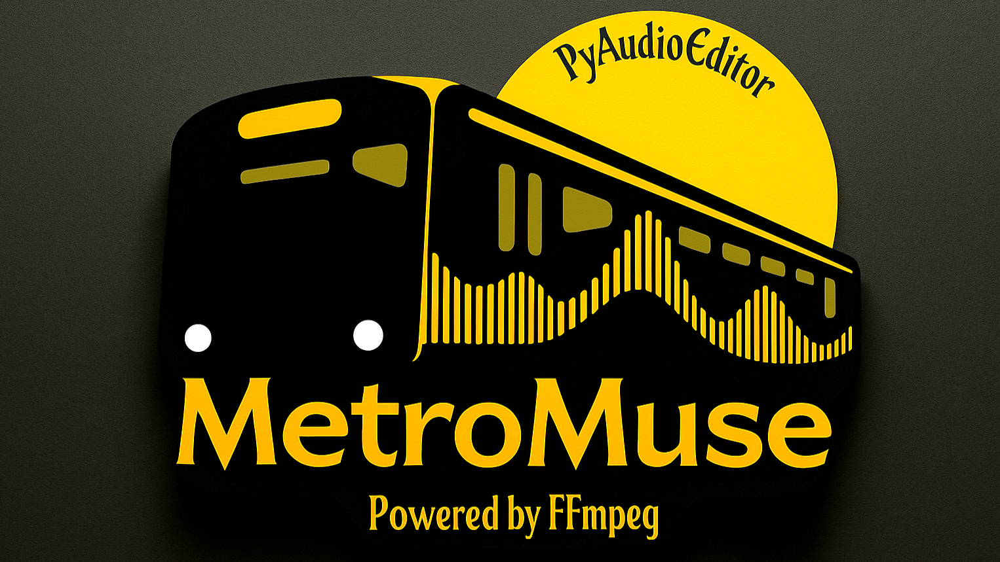

# 
## MetroMuse — Audio Editor
**Version 0.10.0 (INCOMPLETE BETA)**

> ⚠️ **Disclaimer:** MetroMuse is currently in beta. Some features may be incomplete, unstable, or under development.

A **modern, cross-platform audio editor** with multitrack capabilities, enhanced waveform visualization, and an intuitive, sleek interface.

---

## 📸 Preview


---
## 🤝 Contributing

MetroMuse is open source and welcomes contributors! You can help by:

- Reporting issues
- Improving existing features
- Refactoring code
- Designing UI components
- Translating to other languages
---

## ✨ Features

### 🎚️ Multitrack Support
- Manage multiple audio tracks effortlessly
- Solo, mute, and volume control per track
- Individual color coding and track organization
- Synchronized playback across all tracks
- Easy track naming and management

### 📊 Enhanced Waveform Visualization
- Interactive, zoomable waveform display
- Adaptive time grids and markers
- Real-time amplitude monitoring
- Smooth zoom, scroll, and scrubbing functionality

### ✂️ Audio Editing Tools
- Cut, copy, paste with precision
- Selection-based and track-specific editing
- Multiple undo/redo levels
- Non-destructive editing workflow

### 🎛️ Audio Effects
- Volume gain adjustment
- Fade-in and fade-out effects
- Real-time effect preview
- Per-track parameter control

### ▶️ Advanced Playback
- Synchronized multi-track playback
- Real-time scrubbing and position tracking
- Solo/mute functionality for detailed mixing

### 🎨 Modern Interface
- Dark theme with accent color highlights
- Large, accessible UI elements (48x48px)
- Collapsible panels and intuitive navigation
- Enhanced visual feedback

### 💾 File Format Support
- Import and export: WAV, FLAC, MP3, AAC
- Drag-and-drop audio importing
- Recent files management
- Display of file metadata and information

### 🔧 Under-the-Hood Technical Features
- Sample-accurate editing
- High-quality multi-channel audio processing
- Real-time waveform updates
- Efficient rendering pipeline

---

## 🛠️ Development Status (v0.10.0)

| Component        | Status        | Notes                                             |
| ---------------- | ------------- | ------------------------------------------------- |
| Waveform Display | 🟡 Functional | Includes scrubbing, time grid, and markers         |
| Multitrack       | 🟡 Functional | Fully functional with controls and organization   |
| Editing Tools    | 🟡 Functional | Basic editing tools with undo/redo support         |
| Exporting        | 🟡 Functional | WAV, FLAC, MP3, AAC export supported               |
| Playback         | 🟡 Functional | Synchronized, real-time multitrack playback        |
| UI/UX            | 🟡 Functional | Dark-themed, responsive interface                  |

---

## 🗂️ Project Structure

```
MetroMuse/
│
├── src/
│   ├── metro_muse.py        # Main application
│   ├── track_manager.py     # Multitrack management
│   ├── track_renderer.py    # Waveform rendering
│   ├── styles.qss           # UI styling (QSS format)
│   ├── icon.png             # App icon (PNG)
│   └── icon.ico             # App icon (ICO for Windows)
│
├── resources/
│   ├── ffmpeg.exe           # Audio processing binary
│   ├── ffprobe.exe          # Media analysis binary
│   └── ffplay.exe           # Audio playback binary
│
├── requirements.txt         # Python dependencies list
└── README.md                 # Project documentation
```

---

## 📦 Dependencies

- **PyQt5** – GUI framework
- **numpy** – Audio processing
- **matplotlib** – Waveform visualization
- **pydub** – Audio file handling
- **librosa** – Audio analysis
- **sounddevice** – Audio playback
- **qtsvg** – SVG icon support
- **python-qss** – Stylesheet management
- **PyQt5-stubs** – Type hinting for PyQt5
- **ffmpeg** (external) – Media processing (MP3, AAC, FLAC support)

---

## 🚀 Installation

1. Clone the repository:
   ```bash
   git clone https://github.com/Ivan-Ayub97/MetroMuse-AudioEditor.git
   cd MetroMuse
   ```

2. Install Python dependencies:
   ```bash
   pip install -r requirements.txt
   ```

3. Install **ffmpeg**:
   - **Windows**:
     ```bash
     winget install ffmpeg
     ```
     And place `ffmpeg.exe`, `ffprobe.exe`, and `ffplay.exe` inside the `resources/` folder.
   - **macOS**:
     ```bash
     brew install ffmpeg
     ```
   - **Linux**:
     ```bash
     sudo apt install ffmpeg
     ```

---

## 🎮 Usage Guide

Run MetroMuse:

```bash
python src/metro_muse.py
```

### Key Operations

| Action            | Shortcut/Action                 |
| ----------------- | ------------------------------- |
| Add Track         | "+ Add Track" button             |
| Import Audio      | "Import Audio" button / Drag-and-drop |
| Delete Track      | Click "✕" on track header        |
| Play/Pause        | Spacebar                        |
| Stop Playback     | Esc                             |
| Rewind            | Home key                        |
| Fast Forward      | End key                         |
| Scrub             | Click and drag on waveform       |
| Zoom In/Out       | Mouse Wheel / Ctrl + Mouse Wheel |
| Pan View          | Arrow keys                      |

---

## 🔥 Planned Features

- Spectrum analysis view
- Additional effects: echo, reverb, equalization
- VST plugin support
- Project saving and loading
- Track automation features
- Improved error handling
- In-app user guides and onboarding dialogs

---

## ⚠️ Known Issues

- Exporting may fail if **ffmpeg** is not correctly configured
- Some audio effects (echo, reverb) are under active development
- VST plugin support is pending implementation
- Project saving/loading is not yet functional

---

## 💻 System Requirements

- **Python**: 3.7 or higher
- **External Tools**: ffmpeg (must be installed or included in `resources/`)
- **All listed dependencies** (see [Dependencies](#-dependencies))

---

## 📄 License

This project is licensed under the **[MIT License](LICENSE)**.

---

## 👨‍💻 Author

- **Developer**: [Iván Eduardo Chavez Ayub](https://github.com/Ivan-Ayub97)
- **Contact**: <negroayub97@gmail.com>
- **Technologies**: Python 3, PyQt5, pydub, librosa

---

## 🌟 Why MetroMuse?

Because **sometimes you just need a simple, powerful editor that works**.
MetroMuse is built to provide a **clean, accessible** environment for audio editing—**open-source, evolving**, and designed with a focus on **what matters most to creators**.
